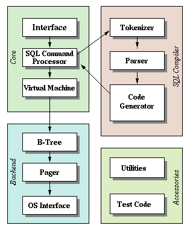

# REPL

---

### Part 2 - World's Simplest SQL Compiler and Virtual Machine

前端（front-end）是一个SQL编译器，解析SQL语句并且生成中间表示得字节码。然后这个
字节码输入到一个虚拟机上执行。

- 输入：SQL 语句
    - 判断，以`.`开始的为`meta-command`
    - 两个SQL语句
        - `Select`和`Insert`

